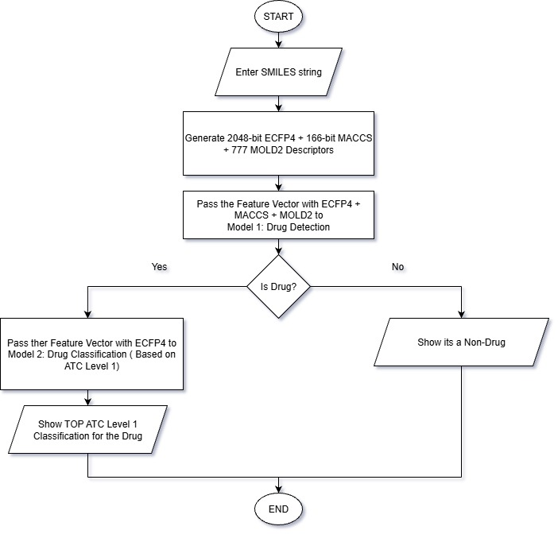

# 💊 Drug Detection and Classification

## 📘 Overview

Creating Logistic-Regression based Drug Detection model and Drug Classification Model with features extracted from SMILES string of molecules.

This project is a group effort and part of Summer Internship at IIT Guwahati.
The data preperation and feature extraction strategies used in this project were based on the [_Prediction of Drug-Likeness Using Deep Autoencoder Neural Networks_](https://doi.org/10.3389/fgene.2018.00585) and [_SuperPred 3.0: drug classification and target prediction—a machine learning approach_](https://pmc.ncbi.nlm.nih.gov/articles/PMC9252837/) and other research articles.

Drug Detection used Binary Classification whereas Drug Classification used Multi Class Classification as suggested by the papers.

Both Models can be used together in the following manner



### 👥 Team Members

- **Anwesha Chaudhury**  
  [GitHub](https://github.com/chan1425) | [LinkedIn](https://www.linkedin.com/in/anwesha-chaudhury-67a050292/)

- **Jyotismoy Kalita**  
  [GitHub](https://github.com/JyotismoyKalita/) | [LinkedIn](https://www.linkedin.com/in/jyotismoy-kalita/)

- **Sampurna Biswas**  
  [GitHub](https://github.com/SamPurna023) | [LinkedIn](https://www.linkedin.com/in/sampurna-biswas-7487bb290/)

## 🗂️ Project Structure

```plain
.
└── 📁DrugDetectClassify-IITG/
    ├── 📁Drug Classification/
    │   ├── 📁Data/
    │   │   └── 📁chembl/
    │   │       └── drugs.csv
    │   ├── 📁Dataset/
    │   │   ├── 📁atc/
    │   │   │   └── dataset.csv
    │   │   ├── 📁drug-atc/
    │   │   │   └── dataset.csv
    │   │   └── 📁final/
    │   │       └── dataset.csv
    │   ├── 📁Model/
    │   │   └── drugclass_logreg_bundle.pkl
    │   ├── 📁Output/
    │   │   ├── Class Distribution.png
    │   │   ├── Confusion Matrix.png
    │   │   ├── CV Performance.png
    │   │   └── Hyperparameter Settings.png
    │   ├── dataset.ipynb
    │   └── model.ipynb
    ├── 📁Drug Detection/
    │   ├── Data.rar (❕Extract this)
    │   ├── 📁Data/(❗Extract From Data.rar)
    │   │   ├── 📁negatives/
    │   │   │   ├── 📁combined/
    │   │   │   │   └── negative_set.csv
    │   │   │   ├── 📁dud-e/
    │   │   │   │   └── dude_decoys.csv
    │   │   │   ├── 📁final/
    │   │   │   │   └── negative_set_filtered.csv
    │   │   │   ├── 📁gdb13/
    │   │   │   │   └── gdb13_simple_non_drugs.csv
    │   │   │   ├── 📁gdb17/
    │   │   │   │   └── GDB17.50000000LL.noSR.smi(❗Download)
    │   │   │   ├── 📁tox21/
    │   │   │   │   └── tox21_stress_response_toxics.csv
    │   │   │   └── 📁zinc20/
    │   │   │       └── for-sale.csv
    │   │   └── 📁positives/
    │   │       └── 📁zinc20/
    │   │           └── world.csv
    │   ├── 📁Dataset/
    │   │   ├── final.rar (❕Extract this)
    │   │   ├── negatives.rar (❕Extract this)
    │   │   ├── positives.rar (❕Extract this)
    │   │   ├── 📁final/ (❗Extract From final.rar)
    │   │   │   └── dataset.csv
    │   │   ├── 📁negatives/ (❗Extract From negatives.rar)
    │   │   │   └── dataset.csv
    │   │   └── 📁positives/ (❗Extract From positives.rar)
    │   │       └── dataset.csv
    │   ├── 📁Model/
    │   │   └── druglikeness_logreg_bundle.pkl
    │   ├── 📁Output/
    │   │   ├── Class Distribution.png
    │   │   ├── Confusion CV Opt.png
    │   │   ├── Confusion CV.png
    │   │   ├── Confusion Test.png
    │   │   ├── Hyperparameters.png
    │   │   ├── Performance CV.png
    │   │   └── Performance Test.png
    │   ├── 📁Tools/
    │   │   └── Mold2-Executable-File.zip(❗Download)
    │   ├── dataset.ipynb
    │   └── model.ipynb
    ├── 📁Images/
    │   └── Flowchart.jpg
    ├── .gitignore
    ├── app.py
    ├── environment.yaml
    ├── LICENSE
    └── README.md
```

## ⚙️ Environment Setup (via Conda)

To replicate this environment, use the included environment.yml file. The environment.yml file can be used to replicate the Python environment via Conda.

✅ Step-by-step:
Clone the repository:

```bash
git clone https://github.com/JyotismoyKalita/DrugDetectClassify-IITG.git
cd DrugDetectClassify-IITG
```

Create the conda environment:

```bash
conda env create -f environment.yml
```

Activate the environment:

```bash
conda activate drug-detection
```

(Optional) If using Jupyter Notebooks:

```bash
jupyter notebook
```

### 📦 Included in the Environment

- python 3.10
- scikit-learn
- pandas
- numpy
- rdkit
- tqdm
- ipykernel
- seaborn
- matplotlib
- joblib
- imbalanced-learn

#### ❗ Troubleshooting

If RDKit fails to install: make sure you're using conda, not pip.

This environment uses the conda-forge channel for compatibility.

## 🪶 Feature Extractor

Molecules after preprocessing were calculated by MOLD2 [(Hong et al., 2008)](https://pubs.acs.org/doi/10.1021/ci800038f), resulting a descriptor matrix of ∼700 descriptors per molecule.

To be able to use MolD2 from notebook/python script, we used [MolD2-pywrapper](https://pypi.org/project/Mold2-pywrapper/)

**Download**: [MolD2](https://www.fda.gov/science-research/mold2/access-mold2)

### 🔨 Installation

- Download the _`Mold2-Executable-File.zip`_ from the given link and place it in `Drug Detection/Tools/` folder.

- `MolD2-pywrapper` is not available through conda, hence use `pip` to install it  

  ```sh
    conda activate drug-detection
    pip install MolD2-pywrapper
  ```

## 🔍 Drug Detection

## 📦 Data Preperation

### 🔗 Sources

Drug:

- ZINC20: [https://zinc20.docking.org/substances/subsets/world](https://zinc20.docking.org/substances/subsets/world)

Non-Drug Like:

- ZINC20: [https://zinc20.docking.org/substances/subsets/for-sale](https://zinc20.docking.org/substances/subsets/for-sale) - for sale subset
- Tox21: [https://tripod.nih.gov/tox21/challenge/](https://tripod.nih.gov/tox21/challenge/) - Stress Response Section
- GDB17: [https://gdb.unibe.ch/downloads/](https://gdb.unibe.ch/downloads/) - `❗Download` GDB17.50000000LLnoSR.smi.gz and extract the `.smi` file in `Drug Detection/Data/negatives/gdb17/`. As the file is too big it isn't provided in the repository
- GDB13: [https://gdb.unibe.ch/downloads/](https://gdb.unibe.ch/downloads/) - gdb13.g.tgz, gdb13.cn.tgz, gdb13.co.tgz, gdb13.cno.tgz
- Dud-E: [https://dude.docking.org/](https://dude.docking.org/) - all.tar.gz

The dataset generating tasks were performed in ``Drug Detection/dataset.ipynb``.

---

### Generating Dataset

`Data.rar` must be extracted inside the `Drug Detection` folder, which extracts `Data` folder in it.

`final.rar`, `negatives.rar` and `positives.rar` must be extracted inside the `Drug Detection/Dataset/` folder, which extracts `final`, `negatives` and `positives` folder in it.

**Positive(drug):**

- ZINC20
  - Filters: World
  - Location: ``Drug Detection//Data/positives/zinc20/world.csv``

**Negative(non-drug like):**

- ZINC20
  - Filters: for-sale
  - Location: ``Drug Detection//Data/negatives/zinc20/for-sale.csv``
- Tox21
  - Filters: stress response actives
  - Location: ``Drug Detection//Data/negatives/tox21_stress_response_toxics.csv``
- GDB13
  - Filters: Molecules having C, CO, CN,CNO
  - Location: ``Drug Detection//Data/negatives/gdb13/gdb13_simple_non_drugs.csv``
- GDB17
  - Filters: Lead Like without Small Rings
  - Location: ``Drug Detection//Data/negatives/gdb17/GDB17.50000000LLnoSR.smi``
- Dud-E
  - Location: ``Drug Detection//Data/negatives/dud-e/dude_decoys.csv``

---

#### ✅ Drug Dataset

Generating a Drug dataset with Features:  
**777** descriptors extracted using MolD2 + **2048**-bit ECFP4 Fingerprints + **166**-bit MACCS Fingerprints  
Total Drugs in drug Dataset = **5897**

The feature-extracted drugs dataset was saved to file `Drug Detection/Dataset/positives/dataset.csv`.

---

#### ❌ Non-Drug Like Dataset

Generating a Non-Drug Like dataset with Features:
**777** descriptors extracted using MolD2 + **2048**-bit ECFP4 Fingerprints + **166**-bit MACCS Fingerprints  
Total Non-Drugs in non-drug like Dataset = **56251**

The feature-extracted non-drug like dataset was saved to file `Drug Detection/Dataset/positives/dataset.csv`.

---

#### 🔀 Final Dataset

Generating a Combined Dataset of both Drugs and Non-drug likes.  
Assigned target column **"Is Drug"** with **0 for non-drug likes** and **1 for drugs**.

Total Molecules = **5897**(Drugs) + **56251**(Non-Drugs) - _Duplicates and NaNs_ = **62134**

The molecules of drugs and non-drug likes were mixed and then shuffled and the dataset was saved to file ``Drug Detection/Dataset/final/dataset.csv``

**📏 Shape:**

- Rows: **62134**

- Columns: **2993** (_2991 Features + 'Is Drug' and 'Smiles' Column_)

## 🎛️ Preprocessing and Model Training & Evaluation

## 1️⃣ Data Preprocessing

- Removed:
  - Full row duplicates
  - Rows with `NaN` or infinite values
- Split:
  - `X` (features) = all except  `Is Drug` and `smiles`
  - `y` = `Is Drug` column

---

## 2️⃣ Train-Test Split

- 80% training, 20% testing using `train_test_split`
- Stratified by target class


---

## 3️⃣ Pipeline

### 🔹 A. Low-Variance Filtering

- Removed fingerprint features with variance < 0.01 using `VarianceThreshold`

### 🔹 B. Standardization

- Scaled features using `StandardScaler`

### 🔹 C. Logistic Regression

- Chose Logistic Regression as the model with **class weights balanced**

---

## 4️⃣ Cross-Validation

- 5-fold cross-validation on **training set**
- Scoring metric: `roc_auc`
- **Threshold was optimized and performance with both default and optimized threshold was measured**

### Hyperparameter Settings


### Performance on CV


### Confusion Matrix CV


---

## 5️⃣ Evaluation

- Evaluated on **test set**

### Performance on Test


### Confusion Matrix Test


---

## 6️⃣ Pipeline Export

 The final bundle with pipeline and best threshold was saved using joblib for future use.  
 This model can later be loaded via:

  ```python
  from joblib import load

 model_bundle = joblib.load("Model/druglikeness_logreg_bundle.pkl")
 pipeline = model_bundle["pipeline"]
 threshold = model_bundle["threshold"]
  ```

---

### ✅ Final Outcome

- End-to-end drug detection pipeline
- Clear visualizations and evaluation metrics
- Pipeline is modular and reproducible, and ready  for deployment

## 🏛️ Drug Classification

## 📦 Data Preperation for Classification

### 🔗 Source for Classification data

Drug and ATC data:

- ChEMBL: [https://www.ebi.ac.uk/chembl/explore/drugs/](https://www.ebi.ac.uk/chembl/explore/drugs/)

The dataset generating tasks were performed in ``Drug Classification/dataset.ipynb``.

---

### ☯️ Drug-ATC Pair Dataset

For the intermediate dataset, two columns `smiles` and `atc_level_1` were extracted from the chembl dataset. The ATC classes were encoded and another column `atc_numeric` was added. The Drug-Atc pair dataset was saved to file `Drug Classification/Dataset/drug-atc/dataset.csv`

The `atc_level_1` to `atc_numeric` mapping were stored in `Drug Classification/Dataset/atc/dataset.csv`

Shape: **3** Rows x **2054** Columns

---

### ⏩ Final Dataset

For the final dataset, 2048-bit ECFP4 Fingerprints were extracted using the smiles string.  
Along with the 2048 features, the `label` column (_atc_numeric_) was added to the final dataset.

Shape: **2049** Rows x **2011** Columns

## 🎛️ Preprocessing and Model Training for Classification

## 1️⃣ Data Preprocessing for Classification

- Removed:
  - Full row duplicates
  - Rows with `NaN` or infinite values
- Split:
  - `X` (features) = all fingerprint columns
  - `y` = `label` column

---

## 2️⃣ Random Oversamplnig

- Minority Classes were oversampled to balance the dataset


---

## 3️⃣ Pipeline for Classification

### 🔹 A. Constant Feature Removal

- Removed constant fingerprint features using `VarianceThreshold`

### 🔹 B. Multi Class Logistic Regression

- Chose Multi Class Logistic Regression as the model

---

## 4️⃣ Cross-Validation for Classification

- 5-fold cross-validation
- Scoring metric: `F1 Macro`
- **Threshold was optimized and performance with both default and optimized threshold was measured**

### Hyperparameter Settings for Classification


### Performance on CV for Classification


### Confusion Matrix CV for Classification


---

## 5️⃣ Pipeline Export

 The final bundle with pipeline was saved using joblib for future use.  
 This model can later be loaded via:

  ```python
  from joblib import load

  bundle = joblib.load(drugclass_logreg_bundle.pkl)
  pipeline = bundle["pipeline"]
  ```

---

### ✅ Final Outcome for classification

- End-to-end drug classification pipeline
- Clear visualizations and evaluation metrics
- Pipeline is modular and reproducible, and ready for deployment

## 📺 Streamlit App to use Extracted Models for Testing

This Streamlit app takes a SMILES string as input and performs a two-stage cheminformatics pipeline:

**🔎 Drug Detection**  
Uses a logistic regression model trained on molecular features (ECFP4, MACCS, and MolD² descriptors) to predict whether the compound is Drug-like or Non-drug.

**🅰️ ATC Level‑1 Classification (only if Drug-like)**  
If the compound is classified as a drug, the app uses a second logistic regression model to predict its ATC Level 1 class using 2048-bit ECFP4 fingerprints.

**🪶 Features**  

- Fast and lightweight inference using pre-trained models
- Built-in MolD² descriptor support
- Clean UI built with Streamlit
- CSV download of ATC predictions
- No external dependencies beyond RDKit and MolD2 wrapper
